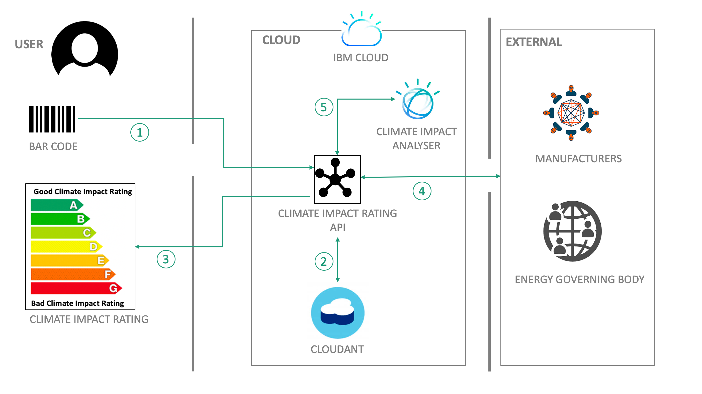
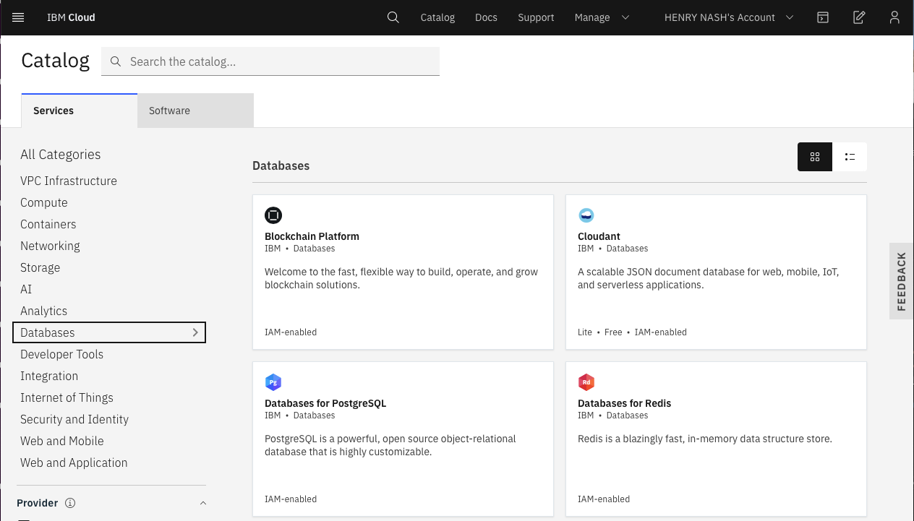
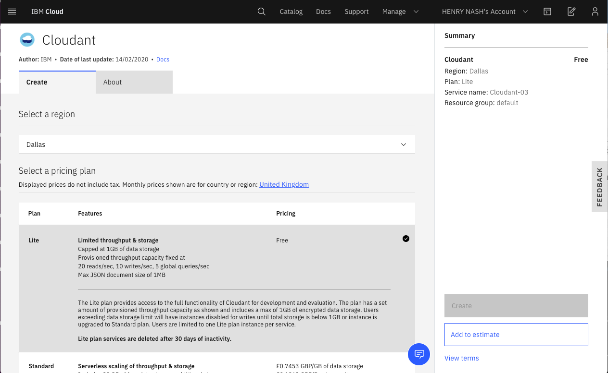
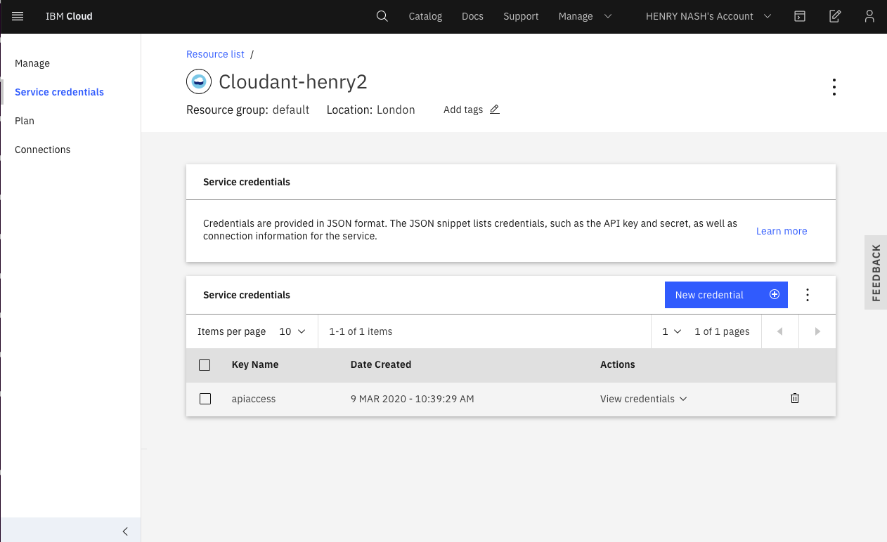
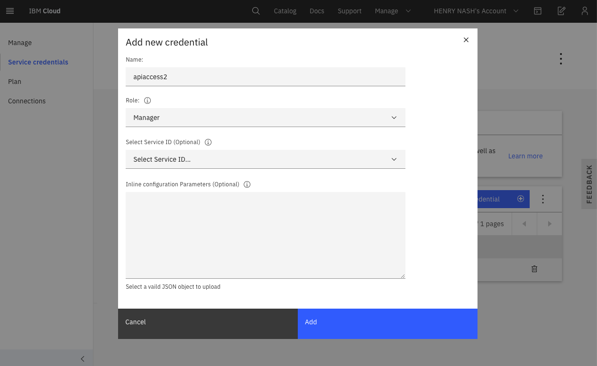
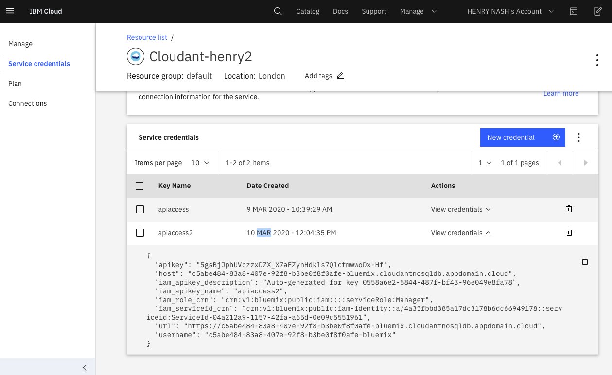
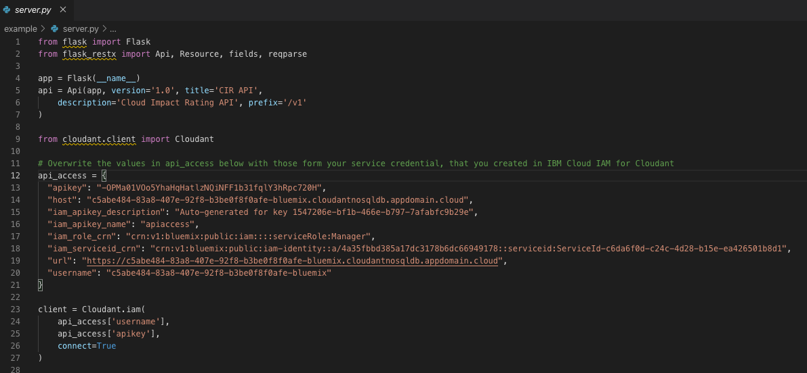
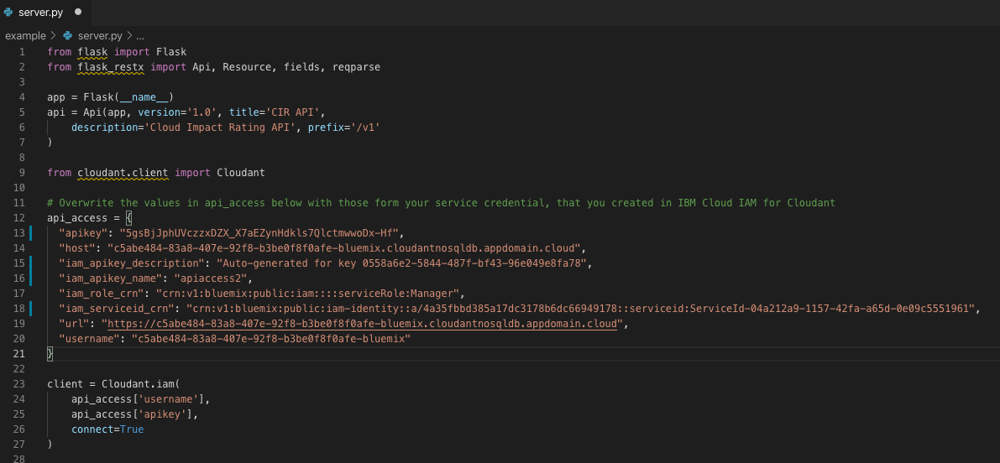
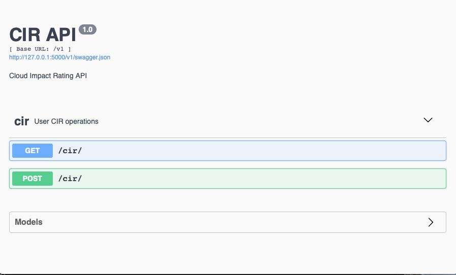

# Energy sustainability in the context of climate change

This solution starter was initially created at the United Nations Human Rights Office in Geneva, Switzerland on February 27-28, 2020, and built out over following 4 weeks. It features contributions by technologists from JPMorgan Chase, Persistent Systems, IBM, and Red Hat.

## Authors

* Vincent Batts - Red Hat
* Binu Midhun - IBM
* Mark Meiklejohn - JPMorgan Chase
* Roberto Mosqueda - Persistent Systems
* Henry Nash - IBM

## Contents

1. [Overview](#overview)
1. [Video](#video)
1. [The idea](#the-idea)
1. [How it works](#how-it-works)
1. [Diagrams](#diagrams)
1. [Documents](#documents)
1. [Datasets](#datasets)
1. [Technology](#technology)
1. [Getting started](#getting-started)
1. [Resources](#resources)
1. [License](#license)

## Overview

### What's the problem

As the population grows, so does the demand for energy. Fossil fuels like coal, oil, and gas have exacted an enormous toll on the environment — from air and water pollution to climate change. By investing in solar, wind, and thermal power, improvements in energy productivity and expanding infrastructure is key to providing clean and more efficient energy.

Read about the [UN Sustainable Development Goal on affordable and clean energy](https://www.undp.org/content/undp/en/home/sustainable-development-goals/goal-7-affordable-and-clean-energy.html).

While the switch to clean energy in our homes will make a real and important impact to the climate, energy usuage in the commercial sector is often higher than in the domestic sector (i.e. that used in homes). A key part of this commercial energy consumption goes into making products that we buy. However, while some products we buy come with an [Energy-efficiency rating](https://ec.europa.eu/info/energy-climate-change-environment/standards-tools-and-labels/products-labelling-rules-and-requirements/energy-label-and-ecodesign/about_en) (e.g. how much energy will my washing machine consume when I use it?), there is nothing provided in terms of the amount of energy (and type of energy, i.e. fossil vs renewable) that was used to manufacture the product in the first place. In fact, if you think about it, to minimize the impact on the climate of prouducts you buy, it would be great to be able to compare the *climate impact* across different manufactures' products. To be complete, this climate impact comparison might also include other things outside of energy - eg. water consumption. What is really needed is a comprehensive *Climate Impact Rating* for products, that can be presented to a consumer as some kind of labelling system.

### How can technology help

Whether it's third-party open source projects or IBM Cloud services, technologies like data analytics, visualization, Internet of Things, Open APIs, databases and blockchain can help address global environmental challenges to track energy (and other consumables) that go into making prodcts. Enabling us to select products that have the lowest climate impact can have a real reduction in our personal impact on the planet.

## Video

[ replace this with Binu's video]

[](https://www.youtube.com/watch?v=hC2b-iP6Rxc)

## The idea

The idea is to expand the global product labelling system, to include a comprehensive *Climate Impact Rating (CIR)*, which will be visible at the point-of-sale (POS) by consumers (be that in-store or on-line). Such a Climate Impact Rating could eventually include:

* Energy Efficiency while in use (this exists today for many products)
* Energy (and energy mix) to produce, potentially expressed as CO2 emitted
* Expected lifetime of product (enabling better comparison between production energy vs in-use energy)
* Other (non-CO2) green-house gas emmissions (e.g. from fertilizer)
* Other consumables, e.g. water
* Recyclability
* Repairability (as part of the Right to Repair initiative)

One of the key challenges of any such labelling system is that it be, first and foremost, understandable by the intended reader - as well as comprehensive in terms of what it includes. We envisage that eventually this would actuially be printed on products (much like today's Energy Efficiency or Food labelling), but ahead of that we would like to enable POS scanning using smart phones to transalate barcodes into a visible rating.

One further item that would be benficial to build in would be to include an estimate of the climate impact of the transporation of the product to the Point-of-Sale (POS). By definition, this could most likely not be printed on the product (since the value at each POS might be different) - but perhaps be looked up be displayed via a smart phone (which would know the location), or online.

Creating such a labelling system is a large and global undertaking, which will require many underlying components, technologies and agreements to come together. For the Call for Code 2020 challenge on Energy we are encouraging you to experiment with building out some of these components - so these can be brought together to enable this overall labelling system. These components fall into a number of categories:

|   |   |
| - | - |
| Core-Architecture | Use the provided starter kit to get a basic system up and running that supports Consumer APIs. Maybe you can develop a better architecure? |
| Rating Display | Develop new and interesting ways of displaying the CIR, e.g. via Augmented Reality (AR) on a mobile deice, within search engines, on product listings etc. |
| Data Science | How best to map raw data into the chosen label. For example, is it better to represent energy as CO2 produced (i.e. it combines amount of energy and use of renewables) or keep these separate? How might we include summary data (e.g. by CO2 per country/region) ahead of having detailed information for a significant number of products? |
| Labelling Design | Experiment (and maybe user test) and then propose design of the label that is both comprehensive and understandable by consumers. Use the experience from food labelling and existing Energy Ratings as examples |
| Additional Storyboards | Develop additional storyboards (and interfaces) for users who are manufactures, administrators and auditors |

If none of the above appeals to you, then no problem! There are, of course, many other aspects of energy sustainability - maybe you could work on one of those. Here are a few other ideas you could explore:

* How might consumers compare their energy use of a particular devices with the usage by others? Maybe they are not using it in an optimal way?
* For those that have no access to an electicity supply (or one that was very intermitent), how might they gain the knowledge to do get a stable supply? For example, how might a community start by using second-hand car batteries (either as a main source or as a backup), and then use that to move up "the energy ladder"? How can basic communications needs be satisfied using these (for instance basic cell phone charging), and that communication be used to get to the next rung on the ladder?

Or maybe you have a better idea altogether?

## How it works

This solution starter provides a basic architecture of you to experiment with building a Climate Rating system, as described earlier, and includes:

* A CouchDB NoSQL database layer holding both individual product rating
* A basic API server that allows data to insert and extract data from the database. This API is expressed as a Swagger (OpenAPI) document, so you can build your own clients.
* Deployment tools to stand up the above on the IBM Cloud, within the free-tier plan (i.e. so it is free for you to experiment)

The database is populated with some inital example data, to get you started.

## Diagrams



### Flow

1. User scans a product barcode with an app, which then calls Climate Impact Rating API, passing in the barcode ID
2. Climate Impact Rating API retrieves the reatings data that matches that barcode ID.
3. Climate Impact Rating API returns the ratings data for the app to format and display appropriately.
4. Manufacturers can upload product and ratings data via the Climate Impact Rating API (perhaps via a reserved portal)
5. In the future, a Climate Impact Analyzer will run in the background to produce summary data, enabling broader ratings queries to be satisfied by the API.

## Documents

* [Data Tools & Maps](https://www.eia.gov/tools/)
* [Existing Energystar Ratings System](https://www.energystar.gov/)
* [EU Energy Ratings System](https://ec.europa.eu/info/energy-climate-change-environment/standards-tools-and-labels/products-labelling-rules-and-requirements/energy-label-and-ecodesign/about_en)
* [Traffic Light Food Labelling](https://en.wikipedia.org/wiki/Traffic_light_rating_system)

## Datasets

* [World consumption averages, and break down per capita](https://en.wikipedia.org/wiki/List_of_countries_by_electricity_consumption)
* [Power plant information](https://www.eia.gov/state/maps.php)

## Technology

* [IBM Cloudant](https://www.ibm.com/cloud/cloudant)
* [Flask - A lightweight WSGI web application framework](https://palletsprojects.com/p/flask/)

## Getting started

### Prerequisites

You should have a basic understanding of calling APIs via http. You could also learn more about using [Swagger/OpenAPI](https://swagger.io/docs/specification/about/).

Also, you'll need an [IBM Cloud account](https://cloud.ibm.com), with the latest IBM Cloud tools on your local machine.

### Steps

1. [Clone this repo](#1-provision-mysql)
1. [Provision a CouchDB instance using Cloudant](#1-provision-mysql)
1. [Prepare the API Server](#2-create-openwhisk-actions-and-mappings)
1. [Run the API Server](#2-create-openwhisk-actions-and-mappings)
1. [Test API endpoints](#3-test-api-endpoints)

### 1. Clone this repo

Clone this repo, so that you have a copy of the API server locally on your machine.

### 2. Provision a CouchDB instance using Cloudant

Log into the IBM Cloud and provision a [CouchDB instance using Cloudant](https://www.ibm.com/cloud/cloudant). From the catalog, select Databases and the Cloudant panel:



Once selected, you can choose your Cloudant plan - there is a free tier for simple testing that is sufficent to run this CIR example. It is recommended you  choose `IAM Only` authentication.



Once your Cloudant instance has been created, you need to create a service credential that the CIR API Server can use to communicate with it. By selecting your running cloudant instance, you can choose `Service Credentials` from the left hand menu:



Create a new service credential. giving it a name (it doesn't matter what you call it):



Once created, you can display and copy the credentials, so you are ready to paste it into the code of the API Server in the next step:



### 2. Prepare the API Server

To prepare the API Server, you need to paste in the service credientials you created in the step above. Open the file example/server.py and you will see that an old credential is defined near the top of the file:



You need to replace this with the credentials you just created, for example:



Save the file, and your API server is ready to run!

### 3. Run the API Server

You can run the API server either locally on your machine, or in a Docker container. The server requires python, flask, flaskrestx, so you may find it easier to run it in a container (a Docker file is provdided).

#### Run the API Server in a Docker Container

To build and run a docker image of the API server (assuming you have docker set up on your machine), from the `example` directory in your cloned repo:

```bash
docker build . -t cir-api-server
docker run -p 8080:8080 cir-api-server
 * Serving Flask app "./server.py"
 * Environment: production
   WARNING: This is a development server. Do not use it in a production deployment.
   Use a production WSGI server instead.
 * Debug mode: off
 * Running on http://0.0.0.0:8080/ (Press CTRL+C to quit)
```

The API will then be available on `http://0.0.0.0:8080`.

#### Run the API Server locally

To run the API server locally, you need to ensure all the dependencies are installed on your local machine. A Pipefile is provided to enable pipenv to install the specific dependancies - you first need to ensure you have python (3.6.x recommended) and pipenv installed. Here's an example of doing this on MacOS:

```bash
brew install python
pip install --user pipenv
pipenv install
```

Now that you have the dependencies, you can run the API server itself (from within the `example` directory in your cloned repo)

```bash
pipenv run python ./server.py
 * Serving Flask app "server" (lazy loading)
 * Environment: production
   WARNING: This is a development server. Do not use it in a production deployment.
   Use a production WSGI server instead.
 * Debug mode: off
 * Running on http://127.0.0.1:5000/ (Press CTRL+C to quit)
```

### 4. Test API endpoints

The first time you execute an API, the API server will create the product CIR database and upload it with a small amount of dummy data, so that you can experiment.

As mentioned above, if you are running locally the API will be published on `127.0.0.1:5000`, while if running by docker it will be published on `http://0.0.0.0:8080`. The API Server will also render a Swagger/OpenAPI specification for the API, at this root url:



Clicking on the swagger.json url at the top of the screen allows you to extract the swagger specification, for use by Swagger/OpenAPI tooling to generate a client in the language of your choice.

You can also use curl to execute simple actions. For example, to retrieve a product CIR for a given barcode:

```bash
curl "http://127.0.0.1:5000/v1/product?barcode_id=0125551234508
{"id": "0125551234508", "barcode_id": "0125551234508", "type": "AIR CONDITIONER", "category": "SPLIT AIR-CONDITIONER", "model": "A-890AM", "brand": "Brand - A", "rating_data": {"efficiency": 4, "energy": 44.66160323, "CO2": 46.61812622, "otherGG": 61.61812622, "water": 241.0, "plastic": 1327.42056, "lifetime": 20.0, "recyclability": 9, "repairability": null}}
```

You could also create a new product entry

```bash
curl -d '{"barcode_id": "1125761234500", "type": "REFRIDGERATOR", "category": "FRIDGE_FREEZER", "model": "F-13876", "brand": "Brand - F", "rating_data": {"efficiency": 4, "energy": 44.66160323, "CO2": 46.61812622, "otherGG": 61.61812622, "water": 241.0, "plastic": 1327.42056, "lifetime": 20.0, "recyclability": 9}}' -X POST "http://127.0.0.1:5000/v1/product/" -H "Content-Type: application/json"
```

## Resources

* [IBM Cloud](https://cloud.ibm.com)
* [IBM Cloudant](https://www.ibm.com/cloud/cloudant)

## License

This solution starter is made available under the [Apache 2 License](LICENSE).
